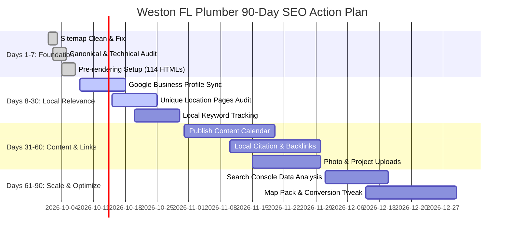

# Weston FL Plumber — Local Authority, Backlink Strategy & 90-Day SEO Action Plan

## 1. Executive Overview

This document outlines the local link-building strategy, Google Business Profile (GBP) optimization checklist, and the structured 90-Day SEO Action Plan for **Weston FL Plumber** (State Certified Plumbing Contractor #CFC1428593, based at 2645 Executive Park Drive, Weston, FL 33331).

---

## 2. Local Authority & Backlinks Strategy

Rather than acquiring low-quality or automated backlink packages, our authority strategy focuses on **high-relevance, reputation-driven local link building** in Weston, Broward County, and South Florida.

### Key Backlink Opportunities

1. **Weston & Broward County Business Directories**:
   - **Weston Business Chamber of Commerce**: Primary local citation and authority signal.
   - **Broward County Business Directory**: Verified county-level citation.
   - **South Florida Better Business Bureau (BBB)**: Accredited local business profile.
   - **MyFloridaLicense (DBPR)**: Active verification link for License #CFC1428593.

2. **Local Contractor & Property Management Partnerships**:
   - **HOA & Property Management Resource Links**: Partnering with HOA management boards in major Weston communities (*Savanna*, *Weston Hills*, *Windmill Ranches*, *Bonaventure*, *Isles at Weston*).
   - **Cross-Contractor Referral Links**: Reciprocal referral partnerships with local South Florida HVAC specialists, roofing contractors, and water damage restoration teams.

3. **Community Involvement & Sponsorships**:
   - Sponsorship of local Weston youth sports leagues, community charity events, and local school athletic programs.

4. **Linkable Local Asset Publishing**:
   - Publishing original research and local guides (such as *Common Plumbing Problems in South Florida Homes* and *South Florida Hard Water Maintenance Guide*) that local real estate blogs, home inspectors, and neighborhood newsletters reference.

---

## 3. 90-Day SEO Action Plan

### Phase 1: Days 1–7 — Fix the Foundation (Completed)
- [x] **Remove Duplicate Sitemap Entries**: Cleaned `generate-sitemap.cjs` to eliminate duplicate `/plumber-<city>-fl` paths. Total unique sitemap URLs updated to 114.
- [x] **Audit Canonical URLs**: Confirmed $1:1$ preferred canonical tags on all pages.
- [x] **Static Pre-Rendering for Technical Crawlers**: Built `prerender.cjs` post-build script to pre-render 114 static HTML pages for instant GSC URL Inspection and crawler readability.
- [x] **Homepage & Core Metadata Optimization**: Aligned homepage title, meta description, H1, and H2 sections with recommended SEO structure.
- [x] **Mobile Call Buttons**: Verified prominent click-to-call buttons (`754-283-8022`) in hero, header, and sticky mobile footer bar.

### Phase 2: Days 8–30 — Improve Local Relevance (In Progress)
- [ ] **Google Business Profile (GBP) Optimization**:
  - Primary Category: `Plumber`
  - Secondary Categories: `Emergency Plumbing Service`, `Drain Cleaning Service`, `Water Heater Repair Service`
  - Address: `2645 Executive Park Drive, Weston, FL 33331`
  - Phone: `(754) 283-8022`
  - Business Hours: 24/7 Availability
  - Service Area: Weston, Miramar, Pembroke Pines, Cooper City, Southwest Ranches, Davie, Plantation, Sunrise, Pembroke Park, Hialeah.
- [x] **Location Landing Page Quality**: Created unique city profiles in `cityData.ts` for all 9 South Florida municipalities with local neighborhoods, housing eras, water utility context, local reviews, and custom FAQs.
- [ ] **Local Keyword Tracking**: Set up rank tracking in Google Search Console and local rank trackers for `Plumber Weston FL`, `Emergency plumber Weston FL`, `Drain cleaning Weston FL`, etc.

### Phase 3: Days 31–60 — Build Traffic Opportunities
- [x] **Publish Useful Plumbing Guides**: Published 8 original blog articles covering emergency pipe shutoffs, drain cleaning signs, high water bills, water heater repair vs replacement, hidden leak detection, South Florida plumbing issues, emergency criteria, and drain cleaning costs.
- [ ] **Local Backlinks & Citations**: Submit verified business details to local Weston directories, chambers of commerce, and contractor networks.
- [ ] **Original Project Photos**: Upload authentic local job-site photos from Weston repairs with geotags and descriptive ALT text to GBP and website gallery.

### Phase 4: Days 61–90 — Measure, Optimize and Scale
- [ ] **Performance Review**: Compare GSC impressions, clicks, CTR, and phone call conversions against pre-optimization baselines.
- [ ] **CTR Optimization**: Re-title and refine meta descriptions for pages with high impressions but low click-through rates.
- [ ] **Google Maps Visibility Expansion**: Monitor local 3-pack rankings across Weston postal codes (33326, 33327, 33331, 33332) and refine local signals based on phone leads generated.

---

## 4. Summary of Implemented Assets

- **Sitemap**: `client/public/sitemap.xml` (114 unique URLs)
- **Robots.txt**: `client/public/robots.txt`
- **Vercel Config**: `vercel.json` (rewrites, clean URLs, security & XML headers)
- **City Data Module**: `client/src/data/cityData.ts`
- **Services Module**: `client/src/data/services.ts`
- **Blog Data Module**: `client/src/data/blogPosts.ts`
- **Blog Directory**: `client/src/pages/BlogDirectory.tsx`
- **Blog Detail Component**: `client/src/pages/BlogPost.tsx`
- **Static Pre-render Script**: `prerender.cjs`
